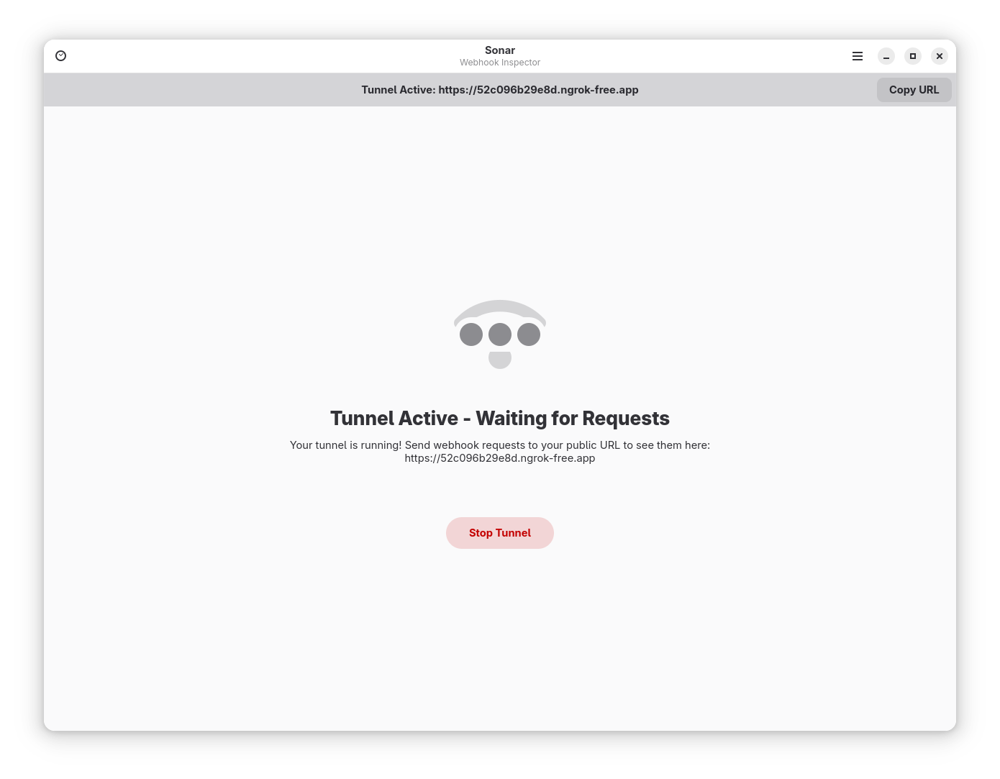
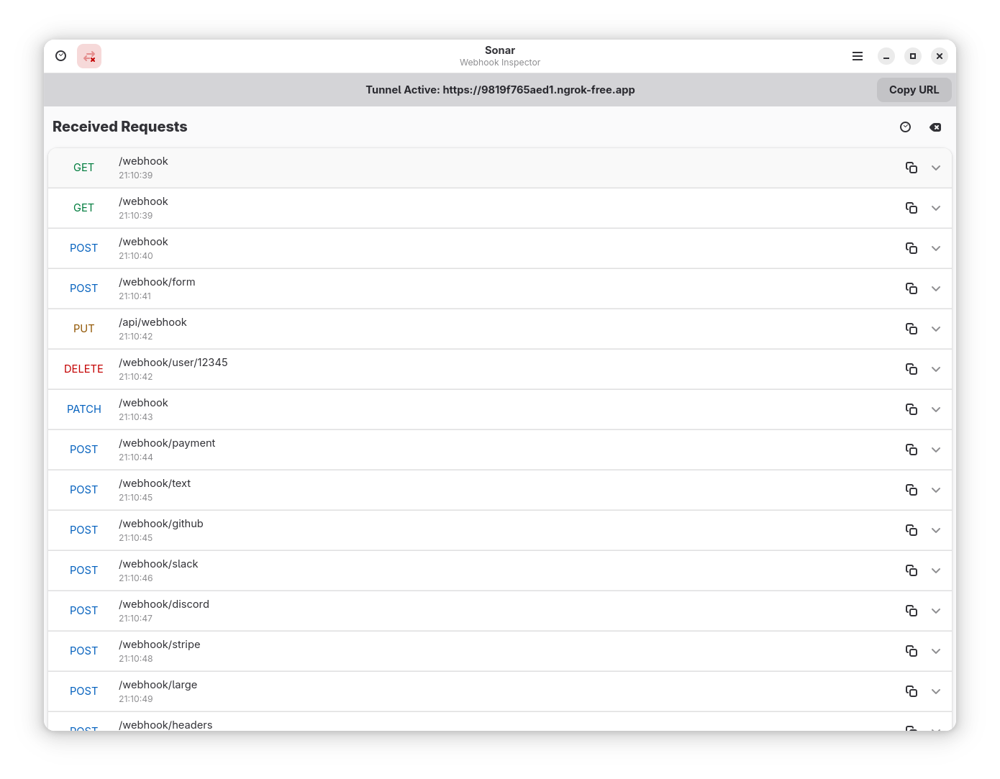
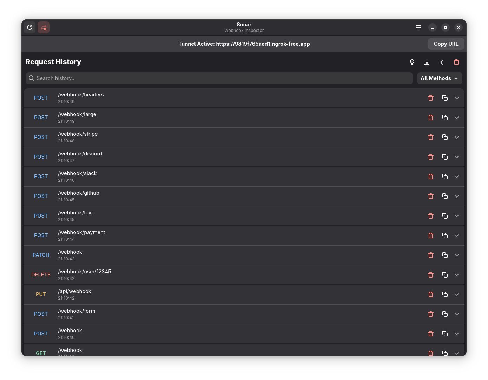
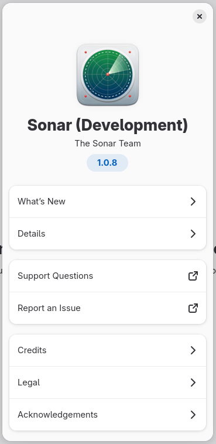

# Sonar

**A modern desktop webhook inspector for developers**

Sonar is a native GTK4 application that provides a beautiful, intuitive interface for capturing and inspecting webhook requests during development. Built with modern technologies and following GNOME design patterns, Sonar makes webhook debugging simple and efficient.


## ✨ Features

### Core Features
- **🔗 Instant Public URLs**: Generate public URLs via ngrok integration for webhook testing
- **📡 Real-time Capture**: Live display of incoming webhook requests as they arrive
- **🔍 Detailed Inspection**: View headers, body content, query parameters, and metadata
- **📋 Quick Copy**: One-click copying of request data, headers, or body content
- **🎯 Accordion UI**: Focus on one request at a time with automatic expansion behavior

### Advanced Features
- **⭐ Request Bookmarking**: Star important requests for quick access
- **🔄 Request Replay**: Resend any webhook to custom URLs with full control
- **⚖️ Request Comparison**: Side-by-side diff of two webhooks to spot differences
- **📝 Request Templates**: Save requests as reusable templates for testing
- **🔀 Webhook Forwarding**: Automatically forward webhooks to multiple URLs
- **🎯 Advanced Filtering**: Filter by method, content-type, time range, and search text
- **📤 Export Options**: Export as JSON, cURL command, or HTTP format

### Developer Tools
- **📊 Analytics Dashboard**: View detailed statistics about your webhook history
- **🔎 Search & Filter**: Powerful search and filtering in request history
- **💾 Persistent History**: All requests saved to disk with JSON storage
- **⌨️ Keyboard Shortcuts**: Comprehensive keyboard shortcuts for productivity

### Technical Excellence
- **⚡ Fast & Lightweight**: Native GTK4 application with minimal resource usage
- **🎨 Modern Design**: Clean Libadwaita interface that integrates perfectly with GNOME
- **🔒 Secure**: Runs sandboxed via Flatpak with minimal required permissions

## 🚀 Installation

### Flatpak (Recommended)

```bash
# Install from Flathub (coming soon)
flatpak install flathub io.github.tobagin.sonar

# Or build locally
git clone https://github.com/tobagin/sonar.git
cd sonar
./build.sh --dev --install
```

### From Source

**Requirements:**
- Vala compiler (valac)
- GTK4 4.8+ development libraries
- Libadwaita 1.4+ development libraries
- libsoup 3.0+ development libraries
- json-glib 1.6+ development libraries
- libgee 0.8+ development libraries
- Meson build system (>= 1.0.0)
- Blueprint compiler

```bash
git clone https://github.com/tobagin/sonar.git
cd sonar
meson setup builddir
meson compile -C builddir
meson install -C builddir
```

## 🔧 Setup

### 1. Install ngrok (Required)

Sonar uses ngrok to create public URLs for webhook testing:

```bash
# Download from https://ngrok.com/download
# Or use package manager:
snap install ngrok          # Ubuntu/Debian
brew install ngrok/ngrok/ngrok  # macOS
```

### 2. Configure ngrok Auth Token

1. Sign up at [ngrok.com](https://ngrok.com) (free account available)
2. Get your auth token from the dashboard
3. Launch Sonar and click "Setup Ngrok Token" to configure

## 📖 Usage

### Basic Workflow

1. **Start Sonar** - Launch the application from your app menu or terminal
2. **Start Tunnel** - Click "Start Tunnel" to create a public URL
3. **Configure Webhook** - Copy the public URL and configure it in your webhook provider
4. **Inspect Requests** - View incoming webhooks in real-time with full details

### Keyboard Shortcuts

**General:**
- `Ctrl+Q` - Quit application
- `Ctrl+,` - Open preferences
- `Ctrl+?` - Show keyboard shortcuts
- `F1` - Show about dialog
- `F11` - Toggle fullscreen

**Tunnel Management:**
- `Ctrl+T` - Start/Stop tunnel
- `Ctrl+U` - Copy public URL
- `F5` - Refresh status

**Request Management:**
- `Ctrl+L` - Clear all requests
- `Ctrl+H` - View history

Press `Ctrl+?` to view all available shortcuts in the app!

### Request Details

Each webhook request shows:
- **Method & Path** - HTTP method and endpoint path
- **Timestamp** - When the request was received
- **Headers** - All HTTP headers with copy functionality
- **Body** - Request body with JSON formatting when applicable
- **Content Type** - MIME type of the request
- **Query Parameters** - URL query string parameters

### Copy Functionality

- **Copy All** - Complete request data as JSON
- **Copy Headers** - Just the headers in HTTP format
- **Copy Body** - Just the request body content
- **Copy as cURL** - Generate cURL command for replaying
- **Copy as HTTP** - Generate raw HTTP request format
- **Copy URL** - The public ngrok URL

### Advanced Features

#### Request Filtering
Filter webhooks by multiple criteria:
- **HTTP Method** - GET, POST, PUT, DELETE, PATCH, etc.
- **Content Type** - JSON, XML, form data, etc.
- **Time Range** - Last 5 min, 15 min, 30 min, hour, or 24 hours
- **Search Text** - Search in path and body content
- **Starred Only** - Show only bookmarked requests

#### Request Replay
Resend any captured webhook to test your endpoints:
1. Click "Replay Request" on any webhook
2. Enter the target URL (pre-filled with original path)
3. Request is sent with original method, headers, and body
4. Get instant feedback on success/failure

#### Request Comparison
Compare two webhooks side-by-side:
1. Click "Select for Comparison" on first request
2. Click "Compare with Selected" on second request
3. View differences highlighted in:
   - HTTP method
   - Request path
   - Content type
   - Headers (side-by-side)
   - Body content (side-by-side)

#### Request Templates
Save webhooks as reusable templates:
1. Click "Save as Template" on any request
2. Give it a name and description
3. Templates are stored persistently
4. Use templates for quick testing scenarios

#### Webhook Forwarding
Automatically forward all incoming webhooks:
1. Open Preferences → Forwarding tab
2. Enable forwarding and add target URLs
3. Choose options:
   - Preserve original HTTP method or force POST
   - Include original headers or send clean
4. All webhooks are forwarded asynchronously
5. Perfect for local development or staging environments

## 📸 Screenshots

| Main Window | Tunnel Started | Received Requests |
|-------------|----------------|-------------------|
|  |  |  |

| History View | Setup Required | About Dialog |
|-------------|----------------|-------------|
|  |  |  |

## 🛠️ Development

### Requirements

- Vala compiler (valac)
- GTK4 4.8+
- Libadwaita 1.4+
- libsoup 3.0+
- json-glib 1.6+
- libgee 0.8+
- Meson build system

### Development Setup

```bash
# Clone and setup
git clone https://github.com/tobagin/sonar.git
cd sonar

# Build for development
./scripts/build.sh --dev

# Install development build
./scripts/build.sh --dev --install

# Run the development version
flatpak run io.github.tobagin.sonar.Devel
```

### Project Structure

```
sonar/
├── src/                    # Vala source code
│   ├── application.vala   # Application entry point
│   ├── main_window.vala   # Main window implementation
│   ├── models.vala        # Data models
│   ├── server.vala        # Webhook server (libsoup)
│   ├── tunnel.vala        # Ngrok tunnel management
│   ├── preferences_dialog.vala    # Settings dialog
│   ├── request_row.vala   # Request list item widget
│   ├── statistics_dialog.vala    # Statistics dashboard
│   └── shortcuts_dialog.vala     # Keyboard shortcuts
├── data/                   # Application data
│   ├── ui/                # Blueprint UI definitions
│   ├── icons/             # Application icons
│   └── io.github.tobagin.sonar.metainfo.xml.in
├── packaging/              # Flatpak manifests
├── po/                     # Internationalization
└── scripts/                # Build scripts
```

### Building UI

Sonar uses Blueprint for UI definition:

```bash
# Compile Blueprint files
blueprint-compiler batch-compile data/ui/ data/ui/ data/ui/*.blp

# Or use the build script
./build.sh --dev
```

## 🤝 Contributing

Contributions are welcome! Please see our [Contributing Guide](CONTRIBUTING.md) for details.

### Reporting Issues

- **Bugs**: Use the [bug report template](.github/ISSUE_TEMPLATE/bug_report.md)
- **Features**: Use the [feature request template](.github/ISSUE_TEMPLATE/feature_request.md)
- **Questions**: Start a [discussion](https://github.com/tobagin/sonar/discussions)

### Development Guidelines

- Follow PEP 8 for Python code
- Use type hints for all functions
- Write tests for new functionality
- Update documentation for user-facing changes
- Test your changes on different distributions

## 📄 License

Sonar is licensed under the [GNU General Public License v3.0](LICENSE).

## 🙏 Acknowledgments

- [ngrok](https://ngrok.com) for providing the tunneling service
- [GNOME](https://gnome.org) for the excellent GTK4 and Libadwaita frameworks
- [Blueprint](https://gitlab.gnome.org/jwestman/blueprint-compiler) for the modern UI definition language
- The Python community for the excellent libraries used in this project

## 📞 Support

- **Documentation**: [Wiki](https://github.com/tobagin/sonar/wiki)
- **Issues**: [GitHub Issues](https://github.com/tobagin/sonar/issues)
- **Discussions**: [GitHub Discussions](https://github.com/tobagin/sonar/discussions)
- **Email**: tobagin@example.com

---

**Made with ❤️ for the developer community**