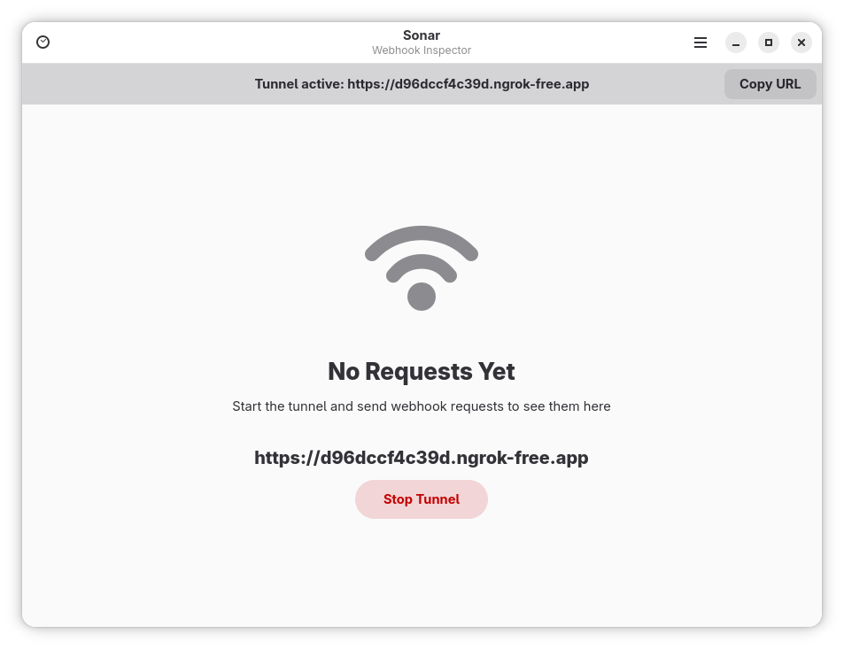
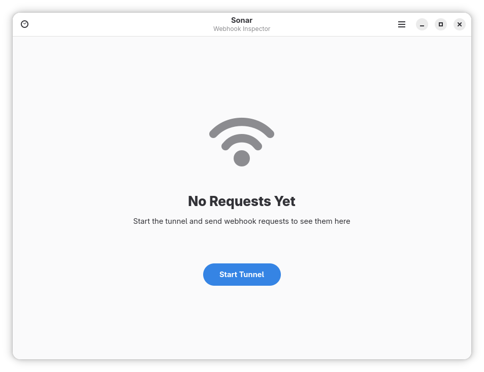
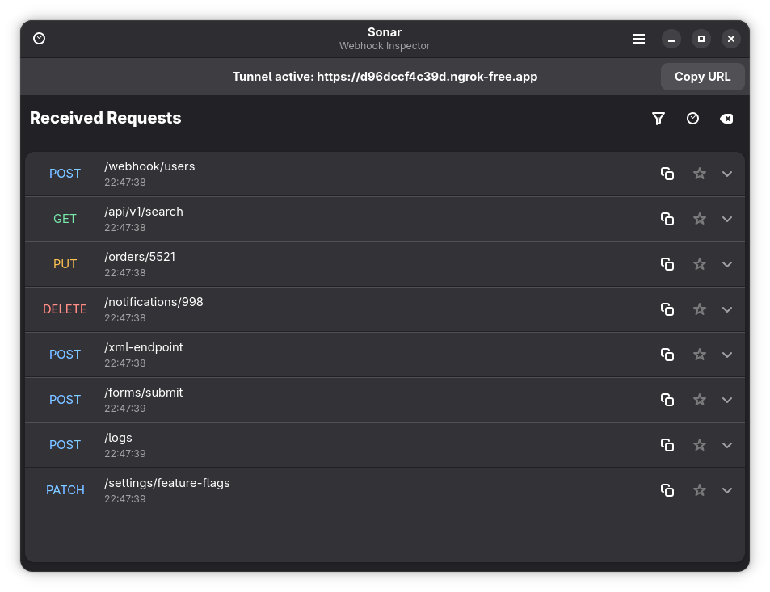
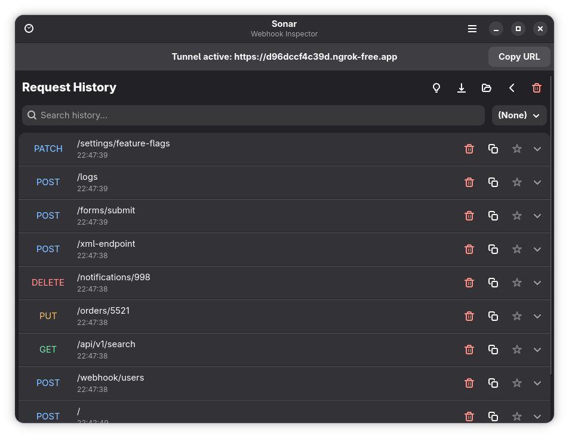
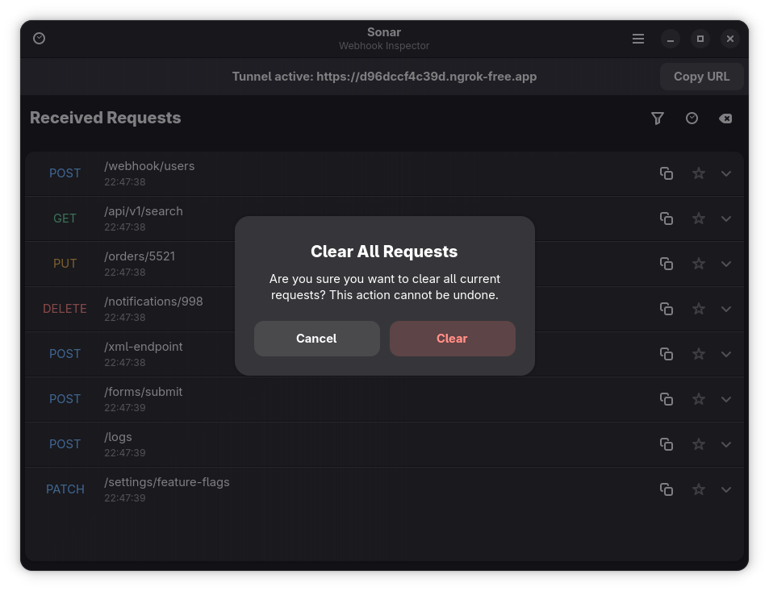
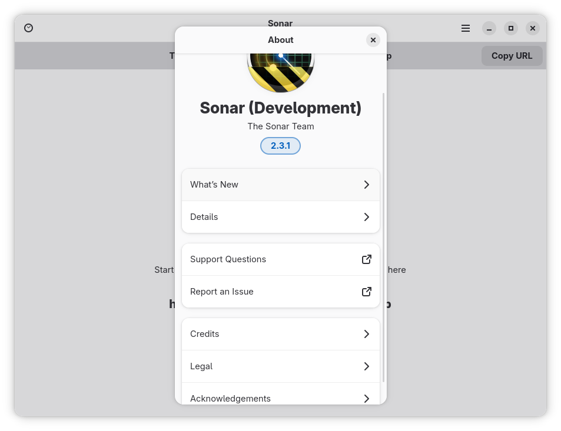

# Sonar

A modern desktop webhook inspector for developers.

<div align="center">



<a href="https://flathub.org/en/apps/io.github.tobagin.sonar"></a>
<a href="https://ko-fi.com/tobagin"></a>

</div>

## 🎉 Version 2.4.0 - Mobile Adaptation

**Sonar 2.4.0** brings full mobile support with a responsive layout.

### 🆕 What's New in 2.4.0

- **Mobile Adaptation**: Fully responsive layout for mobile devices.
- **Refined UI**: Improved request list and action buttons.

For detailed release notes and version history, see [CHANGELOG.md](CHANGELOG.md).

## Features

### Core Features
- **Native Experience**: Built with Vala, GTK4, and Libadwaita for a native GNOME feel.
- **Request Inspection**: Detailed breakdown of HTTP headers, payload, and query params.
- **Search & Filter**: Powerful filtering by method, content-type, and full-text search.

### User Experience
- **Request Replay**: Resend any captured webhook to custom URLs.
- **Templates**: Save requests as reusable templates for testing.
- **Keyboard Shortcuts**: Comprehensive shortcuts for productivity (`Ctrl+?`).
- **Dark Mode**: Fully supports system-wide dark theme preference.

### Security
- **Encrypted Storage**: Credentials never stored in plain text.
- **DoS Protection**: Built-in rate limiting traversal protection.
- **Safe Forwarding**: SSRF prevention and signature validation.

## Building from Source

### Flatpak (Recommended)

#### Development Version
```bash
# Clone the repository
git clone https://github.com/tobagin/sonar.git
cd sonar

# Build and install development version
./scripts/build.sh --dev --install
flatpak run io.github.tobagin.sonar.Devel
```

### From Source

**Requirements:** Vala, GTK4, Libadwaita, libsoup 3.0, json-glib, libgee, libsecret, Meson.

```bash
git clone https://github.com/tobagin/sonar.git
cd sonar
meson setup builddir
meson compile -C builddir
meson install -C builddir
```


## Usage

### Basic Usage

Launch Sonar from your applications menu or run:
```bash
flatpak run io.github.tobagin.sonar.Devel
```

1.  **Start Tunnel**: Click "Start Tunnel" to create a public URL.
2.  **Configure**: Use the URL in your webhook provider.
3.  **Inspect**: Watch requests arrive in real-time.

### Mocking Responses

1.  Open the menu and select **Mock Response** (or press `Ctrl+M`).
2.  Enable mocking and configure the desired status code and body.
3.  Incoming requests will now receive your simulated response.

### Keyboard Shortcuts

- `Ctrl+T` - Start/Stop Tunnel
- `Ctrl+U` - Copy Public URL
- `Ctrl+L` - Clear Requests
- `Ctrl+H` - Toggle History
- `Ctrl+M` - Mock Response Dialog
- `Ctrl+,` - Preferences
- `F1` - About

## Architecture

Sonar is built using modern GNOME technologies:

- **Vala**: For high performance and type safety.
- **GTK4 / Libadwaita**: For the user interface.
- **libsoup 3**: For robust HTTP server/client capabilities.
- **JSON-GLib**: For efficient JSON parsing and generation.

## Privacy & Security

Sonar is designed to respect your privacy and security:

- **Local First**: All request data is stored locally on your machine.
- **Encrypted Secrets**: Auth tokens are stored in the system keyring.
- **Sandboxed**: Distributed as a Flatpak with strict permissions.

## Contributing

Contributions are welcome! Please see [CONTRIBUTING.md](CONTRIBUTING.md) for guidelines.

- Reporting Bugs: [GitHub Issues](https://github.com/tobagin/sonar/issues)
- Discussions: [GitHub Discussions](https://github.com/tobagin/sonar/discussions)

## License

Sonar is licensed under the [GNU General Public License v3.0](LICENSE).

## Acknowledgments

- **ngrok**: For providing the tunneling service.
- **GNOME**: For the excellent GTK4 and Libadwaita frameworks.
- **Vala**: For the powerful programming language.

## Screenshots

| Main Window | Tunnel Started | Received Requests |
|-------------|----------------|-------------------|
|  |  |  |

| History View | Clear Data | About Dialog |
|-------------|----------------|-------------|
|  |  |  |

---

**Sonar** - A modern desktop webhook inspector for developers.